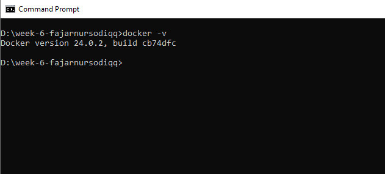

# Week 6 Assignment - Docker

## Introduction

Greetings! This guide aims to delve into the foundational aspects of Docker and its integration with Node.js. By the time you've finished reading, you'll possess a firm grasp of Docker concepts and the skill to adeptly containerize Node.js applications.

## What is Docker?

Docker stands as a potent software platform that simplifies the entire process of constructing, testing, and deploying applications. Through the application of containerization technology, Docker bundles software and its accompanying dependencies into portable entities termed containers. These containers operate autonomously and in isolation, ensuring that application performance remains consistent across diverse environments.

## What is a Container?

A container signifies a standardized software entity that envelops an application as well as its dependencies, facilitating seamless execution across a range of computing environments. Docker containers, known for their lightweight nature, are self-contained entities that encompass every element necessary to operate an application: its code, runtime, system tools, and configuration.

Containers effectively bridge the divide between development and production environments, guaranteeing uniformity and enabling hassle-free deployment and scalability. They furnish a dependable environment in which applications can operate with unwavering consistency.

## Getting Started

### Step 1: Acquiring Docker

1. Pay a visit to the [Docker website](https://www.docker.com/).
2. Procure the version of Docker that aligns with your operating system.
3. Following installation, proceed to establish a Docker account and complete the login process.
4. To validate the installation, execute the command `docker -v` within your terminal.
   

### Step 2: Dockerizing a Node.js App

1. **Creating `package.json`**: This crucial metadata file within Node.js projects encompasses a wealth of project information, dependencies, scripts, and more. A meticulously defined `package.json` expedites collaboration and the management of dependencies.
   

2. **Crafting the `Dockerfile`**: Within this file, articulate the configuration of your Docker image. Employ pivotal commands like `FROM`, `WORKDIR`, `COPY`, `RUN`, `EXPOSE`, and `CMD` to establish the base image, working directory, file transfers, build procedures, exposed ports, and the default container command.
   

3. **Erecting the image**: Execute the command `docker build . -t your_image_name` to encapsulate your application and its prerequisites within a self-sufficient entity primed for consistent deployment.
   

4. **Commencing the container**: Trigger the command `docker run -p your-localport:app-port your_image_name` to initiate the Docker container. The employment of the `-p` flag enables the mapping of a local port to a corresponding port within the container, thereby granting access to the encapsulated application.
   

5. **Confirming the outcome**: Embark on a web browser journey to [http://localhost:your-localport](http://localhost:your-localport) for a glimpse of your Node.js application.
   

## Conclusion

Docker emerges as an invaluable tool streamlining application development, deployment, and management. Through the creation of isolated containers, Docker underscores consistency and portability across a multitude of environments. The act of containerizing Node.js applications facilitates collaborative efforts and seamless scalability, bestowing upon Docker a pivotal role in contemporary software development and deployment workflows.

We extend our gratitude for your time and attention!
